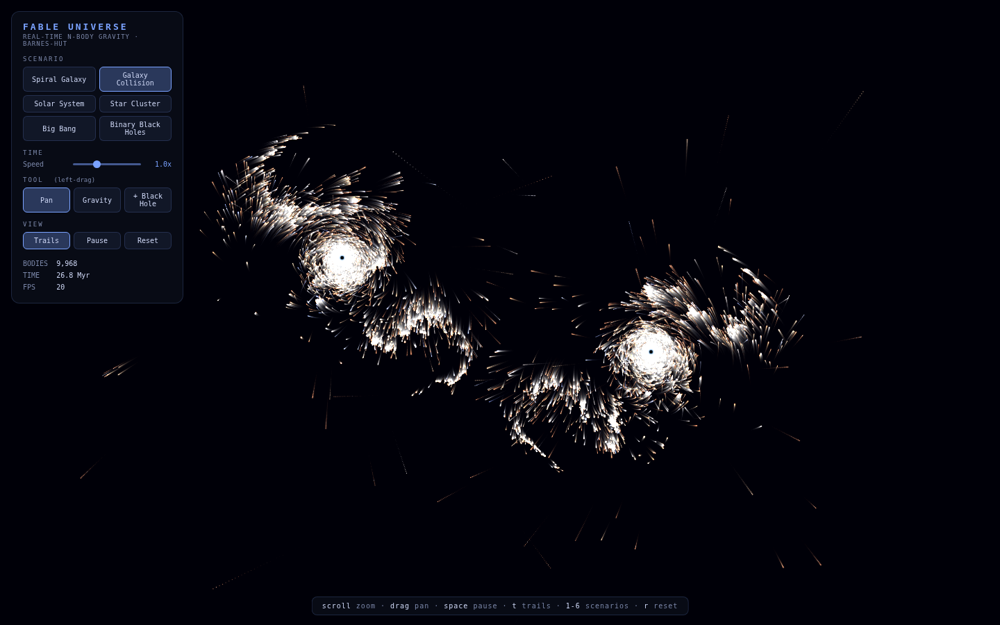

# FABLE UNIVERSE

A real-time, interactive N-body universe simulator in a single page of vanilla
JavaScript. No frameworks, no build step, no dependencies — open
`index.html` and you're holding ~10,000 gravitating bodies.



## Run it

```sh
# any of these
open index.html                # macOS
xdg-open index.html            # Linux
python3 -m http.server 8000    # then visit http://localhost:8000
```

## What's inside

Every star, planet, and black hole attracts every other body through real
Newtonian gravity. Brute force would be O(n²) — hopeless at this scale — so
forces are solved with a **Barnes-Hut quadtree** (O(n log n)), the same
algorithm used in astrophysics research codes: distant clusters of stars are
approximated by their center of mass, controlled by an opening angle θ that
the simulator adapts at runtime to hold the frame rate.

| Scenario | What you'll see |
|---|---|
| **Spiral Galaxy** | 9,000 stars on an exponential disk around a supermassive black hole; arms wind, shear, and fragment like a real flocculent galaxy |
| **Galaxy Collision** | Two galaxies merge — tidal tails, bridge formation, core coalescence |
| **Solar System** | The eight planets plus asteroid and Kuiper belts on Keplerian orbits |
| **Star Cluster** | A Plummer-sphere globular cluster relaxing under self-gravity |
| **Big Bang** | Near-critical Hubble expansion; primordial noise collapses into filaments and clumps |
| **Binary Black Holes** | Two black holes orbit their barycenter while shredding and feeding on their accretion disks |

### Physics details

- Symplectic (semi-implicit) Euler integration with Plummer softening
- Circular velocities from enclosed-mass profiles, so disks start in
  near-equilibrium rotation
- Black holes swallow bodies that cross the capture radius, conserving mass
  and momentum
- Star colors sampled from a realistic stellar population (mostly cool
  red/orange dwarfs, rare blue giants)

## Controls

| Input | Action |
|---|---|
| drag | pan |
| scroll | zoom (about the cursor) |
| **Gravity** tool + hold | pull stars toward the cursor |
| **+ Black Hole** tool + click | drop a black hole and watch it feed |
| `space` | pause |
| `t` | motion trails |
| `1`–`6` | switch scenario |
| `r` | reset scenario |


## Tests

A headless smoke test stubs the DOM, loads the real simulator source, and
drives every scenario for 300 steps, checking numerical stability (no
NaN/Infinity), boundedness (no explosions), per-step performance, momentum
drift, and black-hole accretion:

```sh
node test/smoke.js
```
