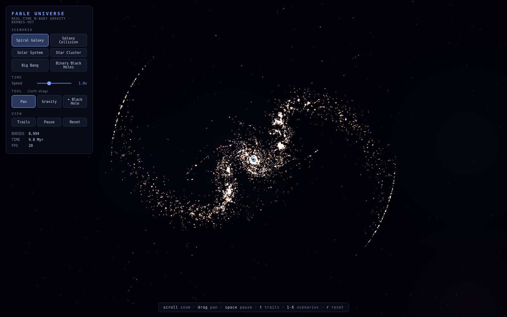
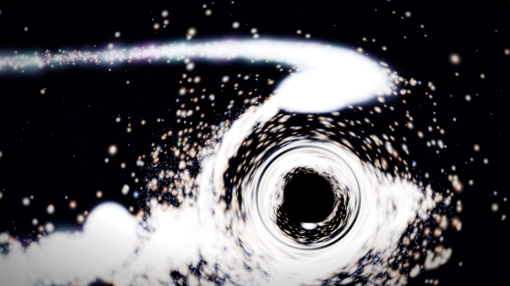
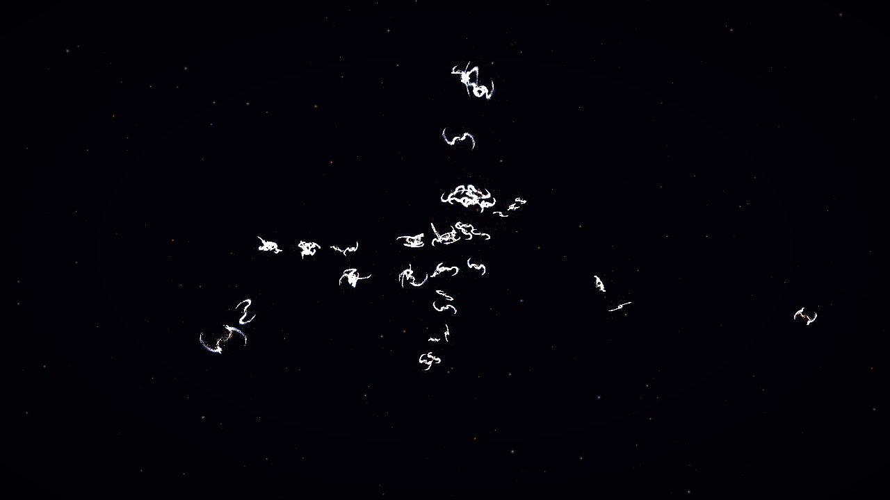
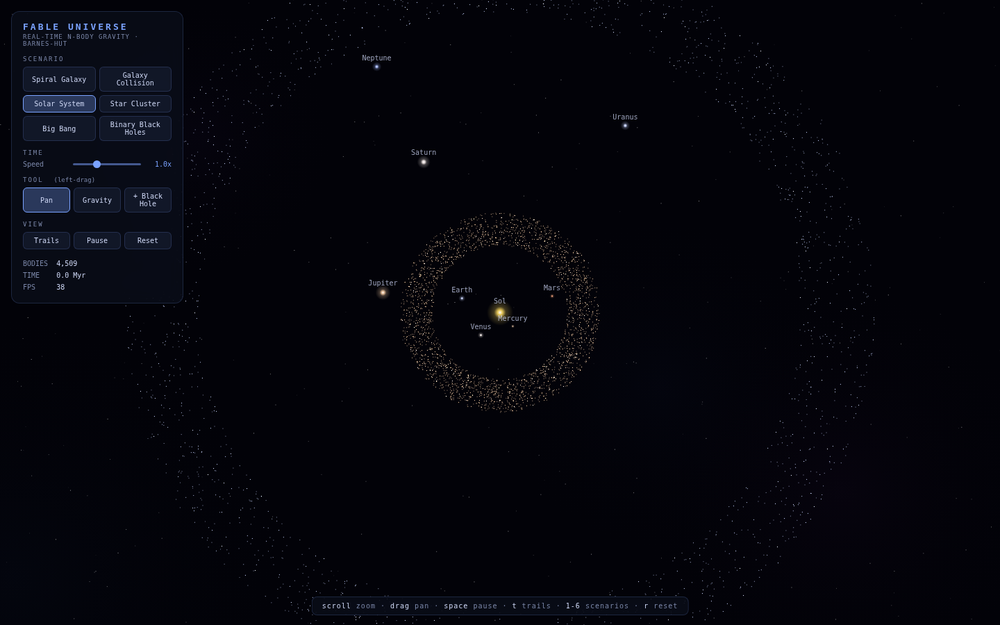
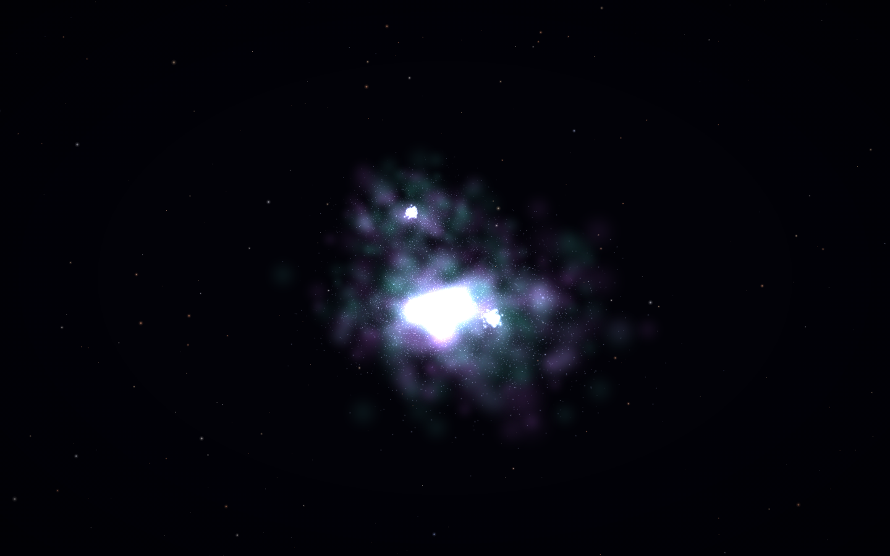

# FABLE : DRIFTER

A **playable universe** in one page of vanilla JavaScript — No Man's Sky ×
Starfield × Cowboy Bebop × Rick and Morty. No frameworks, no build, no
dependencies. You pilot a ship through one continuous, persistent cosmos:
dive from the cosmic web into a galaxy, a star system, a planet's moons;
scan points of interest; hunt bounties; build a codex. Underneath is a real
N-body simulator running up to **2 million** gravitating bodies (WebGPU /
WebGL2 / CPU, auto-selected with graceful fallback).

**Live: https://majveia.github.io/Fable/**  — press **W** to thrust, drag to
steer, scroll to dive in, **F** to scan, **N** to jump, **h** for help.



**v7 — DRIFTER, the playable layer:**
- **Pilot a ship** through the persistent universe (`js/game/ship.js`):
  arcade-Newtonian flight, chase / cockpit / free cameras. The LOD engine
  streams the cosmos around you; the 8 old sandboxes are **merged in** as
  named worlds you fly to (Sol, the Antennae, Orion Nursery, The Maw, …).
- **Scan & discover** (`js/game/poi.js`): procedurally placed stations,
  derelicts, beacons, and rare anomalies & portals; scan them into a codex.
- **Bounties & lore** (`js/game/lore.js`): a deterministic four-voice text
  generator names everything — "The Long Way Station 1670", bounties on
  "Cobalt Volaju" — blending cosmic / corporate / noir / absurd registers.
- **Neon-noir cockpit** (`js/game/hud.js`) + a synthesized **jazz-noir
  score** (`js/game/score.js`). Your discoveries and the universe's age
  **persist** between visits.
- Verified in headless Chromium end-to-end: boot → fly → fast-travel → scan
  → bounty → codex → reload-persists, zero page errors.

**v6 — the persistent universe:**
- **One seed, one continuous cosmos.** Instead of picking scenarios, you
  fly — Universe → Galaxy → Star System → Planet → moons — in one
  unbroken flight. Zoom in to enter a galaxy / star / planet; zoom out to
  leave. A deterministic generator (`js/cosmos/cosmos.js`) lazily grows
  ~50 galaxies along cosmic-web filaments, ~12 visitable systems each,
  planets, and moons — reproducible from the seed across machines.
- **Floating origin + LOD** (`js/cosmos/navigator.js`): exactly one node
  is live-simulated at full fidelity while everything else is analytic
  context, and the world re-centers on it so float32 precision survives
  from supercluster scale down to a moon. Verified in Chromium: a flight
  Universe→Galaxy→System→Planet keeps the local camera under ~10³ units.
- **It ages while you're away** (`js/cosmos/persist.js`): the universe is
  saved (seed + clock) to IndexedDB; time elapsed between visits advances
  the cosmos (galaxies rotate, stars evolve) — 1 real hour ≈ 200 Myr.
  The old eight scenarios remain as a **sandbox** (keys `1`–`8`); the
  universe is the default (`u`, or the leading dot).

**v5 — WebGPU compute:**
- **WGSL compute engine** (`js/webgpu/`): the proven Barnes-Hut kernel as
  a real compute shader over storage buffers — in-place integration (no
  ping-pong), `mapAsync` staging-ring readback that never stalls, and a
  WGSL renderer pulling positions straight from the physics buffers.
  Capacity: **2,097,152 bodies**; the supercluster fills ~1.9M of them.
- Boot chain: WebGPU → WebGL2 hybrid → CPU, automatic; the stat line
  shows which engine you got. Same physics, same scenarios, same look.

**v4 — deeper physics, deeper immersion:**
- **DKD leapfrog integrator** (2nd-order symplectic) on both engines —
  a GPU-integrated circular orbit holds its radius to 0.0% over two
  full periods (CI-verified in headless Chromium)
- **Dark-matter halos**: cored isothermal spheres give every galaxy its
  flat rotation curve; press `d` to switch dark matter off and watch
  the outskirts unbind — the observational argument, live
- **HDR bloom + ACES tone mapping**: cores glow instead of clipping
- **Async fenced GPU readback**: +30 fps at 147k bodies (42 → 72 fps
  even under software rendering)
- **Click-to-focus**: click any star, planet, or black hole to track it
  (`esc` releases); supernovae now leave **expanding remnant shells**
  and ring a soft chime (`m` mutes the ambient soundscape)
- **Shareable URLs**: scenario, seed, dark matter, and time speed live
  in the address bar — send a link, share the exact same universe

**v3 — GPU compute, lensing, evolution, scale:**
- **GPU N-body engine**: the CPU rebuilds a Barnes-Hut octree over the
  ~15k massive bodies each frame and flattens it into a texture with
  stackless escape-pointer links; a fragment shader integrates up to
  **524,288 bodies** against it in parallel. Positions never leave the
  GPU — the renderer reads them straight from the physics textures.
  Falls back to the CPU engine automatically.
- **Gravitational lensing**: screen-space Einstein deflection
  (β = θ·(1−θE²/θ²)) around up to 8 black holes — photon ring, shadow
  disc, inverted inner images.
- **Stellar evolution**: hot stars leave the main sequence, swell into
  red giants, go supernova, and leave white dwarfs, neutron stars, or
  black holes that immediately start feeding.
- **Moons to superclusters**: Earth's Moon, the Galilean moons, and
  Titan on Hill-stable orbits; a new Supercluster scenario strings ~50
  dwarf galaxies along cosmic-web filaments (~500k bodies in GPU mode).




## What's inside

Every star, planet, dust grain, and black hole attracts every massive body
through Newtonian gravity, solved with a **Barnes-Hut octree** (O(n log n)) —
the same family of algorithm used in astrophysics research codes. Massless
tracers (dust, gas) ride the gravitational field of the massive bodies and
are kicked on alternating steps with a doubled timestep (subcycling), which
halves their cost with no first-order trajectory change. The opening angle
adapts at runtime to hold the frame rate on any machine.

Rendering is WebGL2: perspective point sprites with GPU glow, volumetric
gas billboards, sphere impostors for planets (real day/night terminator from
the scene light), black holes with halos, and a far starfield sphere for
parallax. The interface is deliberately minimal — everything fades away
after three seconds and leaves you alone with the universe.

| Scenario | What you'll see |
|---|---|
| **Spiral Galaxy** | Exponential thin disk + central bulge + stellar halo + dust lanes + arm gas, around a supermassive black hole |
| **Galaxy Collision** | Two galaxies on inclined planes merge: tidal tails, bridges, core coalescence |
| **Solar System** | Eight planets with true orbital inclinations, **Saturn's rings as particles orbiting inside its Hill sphere**, asteroid belt, Kuiper belt, scattered disc, comets |
| **Stellar Nursery** | A collapsing molecular cloud with embedded newborn star clusters |
| **Globular Cluster** | A 3D Plummer sphere relaxing under self-gravity |
| **Big Bang** | Near-critical Hubble expansion collapsing into filaments |
| **Binary Black Holes** | Two black holes orbiting their barycenter, shredding accretion disks on *different* orbital planes |




## Controls

| Input | Action |
|---|---|
| drag | orbit |
| shift-drag / right-drag | pan |
| scroll / pinch | zoom |
| `1`–`8` or `←` `→` | scenarios |
| `space` | pause |
| `[` `]` | time speed |
| `t` | motion trails |
| `b` | drop a black hole at the cursor |
| `g` (hold) | gravity well at the cursor |
| click / `esc` | track a body / release |
| `d` | dark matter on/off |
| `m` | sound on/off |
| `r` | reset · `f` fullscreen · `h` help |

## Architecture

See [docs/ARCHITECTURE.md](docs/ARCHITECTURE.md). Plain script-tag modules:
DOM-free physics core (`js/core/`) that runs headless in Node, a WebGL2
render layer (`js/render/`), scenario definitions, and a thin main loop.

## Tests

```sh
node test/core.test.js      # octree vs brute force (1e-15 exact-mode), orbits,
                            # tracer semantics, accretion conservation, perf
node test/treepack.test.js  # GPU tree flattening vs reference traversal
node test/evolution.test.js # determinism, class ordering, remnants, mass loss
node test/smoke.js          # every scenario: stability, bounds, perf budget,
                            # moon-boundness, interleaved evolution
node test/cosmos.test.js       # procedural hierarchy: determinism, laziness,
                               # aging, populate bounds, phase continuity
node test/navigator.test.js    # floating origin + LOD: descent/ascent
                               # sequence, bounded local coords, no flapping
node test/persist.test.js      # aging clock + save/load round-trip
node test/gpu.browser.test.js  # REAL GPU engine in headless Chromium
node test/cosmos.browser.test.js # the persistent universe fly-through in
                               # Chromium: Universe->Galaxy->System->Planet
```

Both run in CI on every push; deployment to GitHub Pages is automatic.
